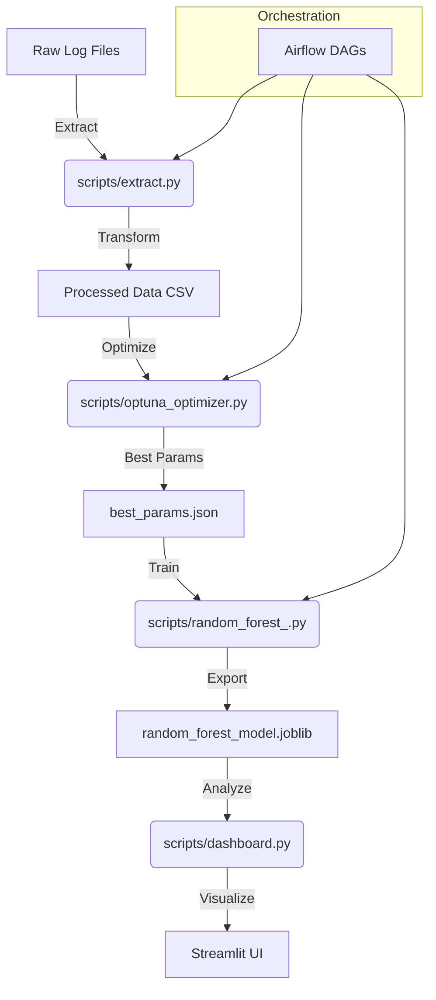

# 📊 LogScan: High-Performance Web Log Analysis & Predictive Modeling

[](https://www.python.org/)
[](https://airflow.apache.org/)
[](https://streamlit.io/)
[](https://www.docker.com/)

LogScan is an enterprise-grade machine learning pipeline designed to ingest raw web server logs, perform automated feature engineering, and train high-accuracy predictive models for response time analysis. It leverages Apache Airflow for robust orchestration and Streamlit for real-time visualization of model performance and insights.

---

## 🚀 Key Features

- **Automated ETL Pipeline**: Robust log parsing engine using Regex and sophisticated feature extraction (OS, Browser, Device parsing).
- **AutoML Orchestration**: Integrated hyperparameter optimization using **Optuna** to ensure peak model performance.
- **Production-Ready Orchestration**: Fully containerized Apache Airflow environment for reliable, scheduled data processing.
- **Interactive Dashboard**: Streamlit-powered visual interface for model evaluation, feature importance analysis, and real-time predictions.
- **Enterprise Design**: Clean, modular architecture following DevOps best practices, complete with unit testing and Dockerization.

---

## 🏗️ Architecture & Workflow



---

## 📁 Project Structure

```text
logscan/
├── dags/                   # Airflow DAG definitions
│   └── main.py             # Core pipeline orchestration
├── data/                   # Log storage (raw & processed)
│   ├── logfiles.log        # Raw server logs
│   └── processed_data.csv  # ML-ready features
├── models/                 # Serialized model artifacts
│   ├── best_params.json    # Optimal hyperparameters
│   └── random_forest_model.joblib
├── notebooks/              # R&D and exploratory analysis
├── scripts/                # Modular logic components
│   ├── extract.py          # Log parsing & feature engineering
│   ├── optuna_optimizer.py # HPO logic
│   ├── random_forest_.py   # Training routines
│   └── dashboard.py        # Streamlit interface
├── tests/                  # Unit & integration testing
├── dockerfile              # Airflow container configuration
└── dockerfile.streamlit    # Dashboard container configuration
```

---

## 🛠️ Getting Started

### Prerequisites

- [Docker](https://www.docker.com/products/docker-desktop/) & [Docker Compose](https://docs.docker.com/compose/install/)
- Python 3.11+ (for local development)

### Local Deployment (Standard)

1. **Clone the repository**:
   ```bash
   git clone https://github.com/your-org/logscan.git
   cd logscan
   ```

2. **Set up virtual environment**:
   ```bash
   python -m venv venv
   source venv/bin/activate  # Windows: .\venv\Scripts\activate
   ```

3. **Install dependencies**:
   ```bash
   pip install -r requirements.txt
   ```

### Dockerized Deployment (Recommended)

1. **Build and start the services**:
   ```bash
   docker-compose up --build
   ```

2. **Access Interfaces**:
   - **Airflow UI**: [http://localhost:8080](http://localhost:8080)
   - **Streamlit Dashboard**: [http://localhost:8501](http://localhost:8501)

---

## 📈 Usage

### 1. Data Generation
To generate synthetic test data, use the `TestFileGenerator.py` script:
```bash
python scripts/TestFileGenerator.py
```

### 2. Running the Pipeline
Trigger the `main` DAG in the Airflow UI. This executes:
- **Extract**: Parses logs and performs dummy encoding.
- **Optuna**: Finds optimal Random Forest parameters.
- **RandomForest**: Trains the final model and exports it to `models/`.

### 3. Launching Dashboard
If running locally without Docker:
```bash
streamlit run scripts/dashboard.py
```

---

## 🧪 Testing

We use `unittest` for validating model performance and data integrity:

```bash
python -m unittest tests/testing_model.py
```

---

## 🛠️ Tech Stack

- **Languge**: Python 3.11
- **ML Frameworks**: Scikit-Learn, Optuna
- **Data Handling**: Pandas, NumPy
- **Orchestration**: Apache Airflow
- **Visualization**: Streamlit, Matplotlib, Seaborn
- **Containerization**: Docker, Docker Compose

---

## 📄 License

Distributed under the MIT License. See `LICENSE` for more information.
